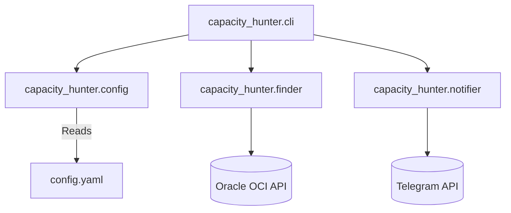

# План реализации (SDD Completion & MVP Finalization)

## [Goal Description]
Цель данного плана — формально завершить процесс Spec-Driven Development (SDD) для `pr-sync`, создать недостающие архитектурные артефакты для `oracle-capacity-hunter-claude`, и технически завершить MVP проекта `oracle-capacity-hunter-claude` (поиск серверов Oracle + Telegram-уведомления).

## User Review Required
> [!IMPORTANT]
> **LLM-генерация отложена:** Согласно нашему решению об экономии ресурсов, интеграция LLM в `pr-sync` (v1.1+) исключена из этого плана. Мы фиксируем v1.0.0. Согласны ли вы с окончательным исключением LLM из текущего скоупа?

> [!WARNING]
> Для MVP `oracle-capacity-hunter-claude` потребуются реальные ключи API (Oracle Cloud OCI, Telegram Bot Token). Убедитесь, что они готовы и хранятся безопасно (например, через `.env` или менеджер секретов), а не в коде.

## Open Questions
1. Нужна ли реализация асинхронного опроса в `finder.py` (через `asyncio`), или для MVP достаточно синхронного цикла с `time.sleep()`?
2. Какой фреймворк или библиотеку будем использовать для Telegram (например, `aiogram` или простые `requests`)?

---

## Proposed Changes

### 1. Документация SDD и Диаграммы (Docs/Architecture Layer)
Завершаем формальные требования Speckit, добавляя недостающие отчеты об анализе и диаграммы.

#### [NEW] `pr-sync/docs/analyze-pr-sync.md`
Формальный отчет `/analyze`. Будет содержать:
- Проверку покрытия инвариантов.
- Ретроспективу (перерасход ресурсов на автогенерацию PR и уроки).
- Риски LLM (недетерминированность, идемпотентность).

#### [NEW] `oracle-capacity-hunter-claude/docs/architecture.md`
Визуализация архитектуры бота с использованием Mermaid.


---

### 2. Завершение MVP: Oracle Capacity Hunter (Business Logic Layer)
Реализация заглушек (stubs) в рабочем проекте, превращение их в рабочий MVP.

#### [MODIFY] `oracle-capacity-hunter-claude/src/capacity_hunter/config.py`
Реализация загрузки `config.yaml` и переменных окружения (токены Telegram, OCI ключи).

#### [MODIFY] `oracle-capacity-hunter-claude/src/capacity_hunter/finder.py`
Реализация логики запроса к Oracle OCI API (поиск инстансов Ampere A1 Compute).

#### [MODIFY] `oracle-capacity-hunter-claude/src/capacity_hunter/notifier.py`
Реализация функции `send_telegram_message(chat_id, text)` для уведомления об успехе/ошибках.

#### [MODIFY] `oracle-capacity-hunter-claude/src/capacity_hunter/cli.py`
Связывание модулей: инициализация конфига, запуск бесконечного цикла `finder`, вызов `notifier` при нахождении ресурса.

---

## Verification Plan

### Automated Tests
```bash
# Для pr-sync (подтверждение фиксации v1.0.0)
cd C:\Users\anton\Projects\sync\pr-sync
pytest tests/ -v

# Для oracle-capacity-hunter-claude
cd C:\Users\anton\Projects\sync\oracle-capacity-hunter-claude
pytest tests/ -v
```

### Manual Verification
1. Открыть сгенерированные файлы `*.md` в Cursor/VS Code и проверить рендеринг Mermaid диаграмм.
2. Локально запустить `capacity_hunter cli` с тестовым конфигом и проверить получение тестового сообщения в Telegram (dry-run mode).
