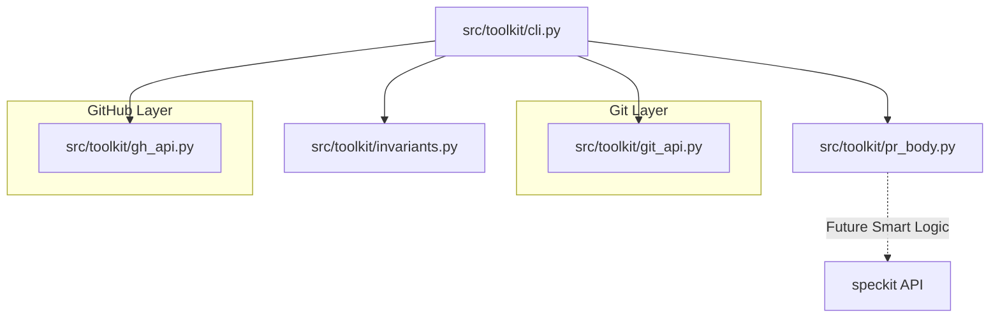
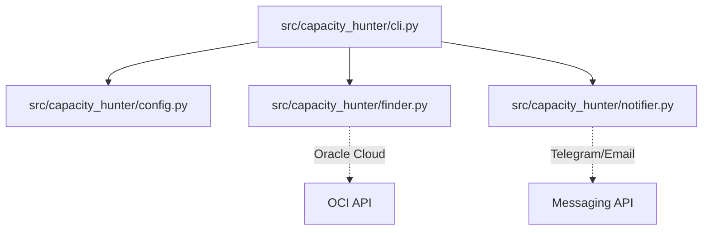

## Goal Description
The objective is to finalize the Spec-Driven Development (SDD) phase for the `automation-toolkit`, explicitly document the architectures of `pr-sync` and `oracle-capacity-hunter-claude` (to ensure optimal logic porting), implement the ideal "smart" PR generation mechanism using `speckit`, and conclude the MVP of both `pr-sync` and `release-sync`.

## SDD Status Checklist & Next Steps
We are effectively compliant with the spirit of SDD. To strictly fulfill Speckit's formal requirements, we will explicitly add the `/analyze` artifact and the visual diagrams.

| Phase (Speckit Command) | Status | Comments / Next Steps |
| :--- | :--- | :--- |
| **Foundation** (`/constitution`, `/specify`, `/clarify`) | ✅ Done | Principles, specs, and invariants are already established in `specs/`. |
| **Implementation** (`/plan`, `/tasks`) | ✅ Done | Tech stack chosen, tasks T001-T009 outlined. |
| **Implementation** (`/implement`) | ✅ Done (v1.0) | `pr-sync` MVP without LLM is working, fully tested. |
| **Analysis** (`/analyze`) | ⚠️ Partial | We need to formally write `docs/analyze-pr-sync.md` to capture LLM risks and invariant coverage. |
| **Visual Architecture** | ⏳ In Progress | We need to build `docs/architecture-pr-sync.md` and `docs/architecture-oracle.md`. |

*Note on "Speckit Representatives":* We don't need external representatives. The SDD core is solid. We just need to formalize the missing artifacts and begin Phase 3 (Smart Generation).

## User Review Required
> [!IMPORTANT]
> **LLM Integration Strategy in `pr_body.py`:** We will introduce `speckit` to parse the `git diff`. Should we fall back to the static template if `speckit` fails (e.g., due to token limits or timeout), or should it strictly fail the PR creation? Defaulting to fallback is recommended for stability.

## Open Questions
> [!NOTE]
> Do you want the architecture diagrams to be stored directly in `pr-sync/docs/` and `oracle-capacity-hunter-claude/docs/`, or in the central `automation-toolkit` repository? (Assuming `pr-sync/docs/` for now).

## Proposed Changes

---
### 1. Architecture Diagrams (Documentation)
Create visual Mermaid diagrams to document the current state and inform the logic porting.

#### [NEW] C:\Users\anton\Projects\sync\pr-sync\docs\architecture-pr-sync.md
```markdown
# pr-sync Architecture


```

#### [NEW] C:\Users\anton\Projects\sync\oracle-capacity-hunter-claude\docs\architecture-oracle.md
```markdown
# Oracle Capacity Hunter Architecture


```

---
### 2. SDD Formalization
#### [NEW] C:\Users\anton\Projects\sync\pr-sync\docs\analyze-pr-sync.md
Formal cross-artifact consistency report summarizing invariant testing and LLM risks, satisfying Speckit's `/analyze` phase.

---
### 3. pr-sync MVP Finalization (Speckit Integration)
Integrate `speckit` into `pr_body.py` to create the "ideal" PR generation mechanism.

#### [MODIFY] C:\Users\anton\Projects\sync\pr-sync\src\toolkit\pr_body.py
```python
import datetime
# NEW: Import speckit or a wrapper for intelligent analysis
import speckit 

def render_pr_body(diff: str, commits: list, base: str = "develop", head: str = "HEAD", changed_files: list = None) -> str:
    # ... existing fallback initialization ...
    
    # PROPOSED SMART LOGIC:
    try:
        # Use speckit to analyze diff and generate summary/risks/testing
        analysis = speckit.analyze_diff(diff)
        summary = analysis.get("summary", "Introduce changes...")
        risks = analysis.get("risks", "- Low: see commit history for scope of change.")
        testing = analysis.get("testing", "- ruff check, pytest, manual smoke test.")
    except Exception as e:
        # Fallback to static template
        summary = f"Introduce changes from branch {head} into {base}."
        risks = "- Low: see commit history for scope of change."
        testing = "- ruff check, pytest, manual smoke test."
    
    # ... return formatted string ...
```

---
### 4. release-sync MVP Scaffolding
Initialize the `release-sync` project structure based on the `release-sync-sdd-docs.docx` specification.

#### [NEW] C:\Users\anton\Projects\sync\release-sync\pyproject.toml
Standard configuration.
#### [NEW] C:\Users\anton\Projects\sync\release-sync\src\release_sync\cli.py
CLI entry point for release generation.
#### [NEW] C:\Users\anton\Projects\sync\release-sync\src\release_sync\changelog.py
Changelog parsing and markdown generation.

## Verification Plan

### Automated Tests
```powershell
# In pr-sync
uv run pytest tests/
```

### Manual Verification
1. Review the generated `.md` files in the `docs` directories.
2. Run `pr-sync` on a test branch to verify `speckit` integration correctly infers the PR summary.
3. Verify `release-sync` skeleton builds correctly.
